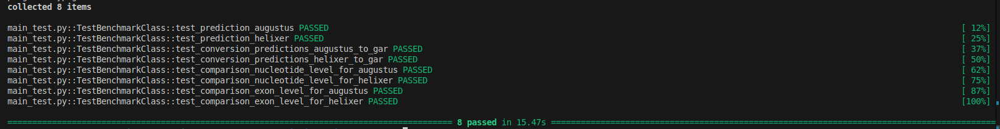
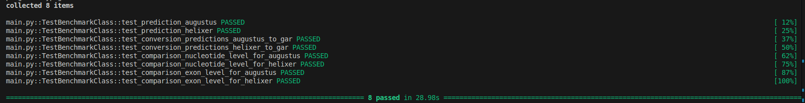

# An Overview of Computational Methods for Gene Prediction in Eukaryotes

<!-- OVERVIEW -->
<h3 id="overview"> Overview </h3>

[To complete. Can add an image if necessary]

> :busts_in_silhouette: __Authors__* `Abigail Djossou and al.`, CoBIUS LAB, Department of Computer Science, Faculty of Science, Université de Sherbrooke, Sherbrooke, Canada*

> :bulb: How to cite us: `upcoming`

> :e-mail: `Contact: abigail.djossou@usherbrooke.ca`

1. [➤ Overview](#overview)
2. [➤ Operating System](#os)
3. [➤ Requirements](#requirements)
4. [➤ Getting Started](#getting-started)
    1. [➤ Example for testing your environment](#main)
    2. [➤ Benchmark](#main)

<!-- Operating System -->
<h3 name="os">Operating System</h3>
The benchmarck program was both developed and tested on a system operating Ubuntu version 24.04.6 LTS.

<!-- Requirements -->
<h3 id="requirements"> Requirements</h3>

*   __`python3 (at leat python 3.6)`__
*   __`pytest`__
*   __`Biopython`__
*   __`bcbio-gff`__
*   __`numpy`__
*   __`pandas`__
*   __`tensorflow`__
*   __`h5py`__

<!-- Getting started -->
<h2 id="getting-started"> :rocket: Getting Started with the benchmark</h2>

* Step 1: Clone the repository with GitHub CLI or using the command 
<pre><code> git clone https://github.com/UdeS-CoBIUS/GenePredictionReviewBenchmark.git</code></pre>

* Step 2: Install the prerequisites tools and make sure they are working
    * ``Àugustus``. You can install it using the following command. Afterwards, you can run `which augustus` — if the installation was successful, it should display the path to the tool, typically something like `/usr/bin/augustus`.
    <pre><code> sudo apt install augustus augustus-data augustus-doc </code></pre>

    * <a href="https://github.com/weberlab-hhu/Helixer?tab=readme-ov-file">``Helixer``</a>.
    Due to the deprecated of the module tensorflow-addons, please, consider the following command after installation of ``Helixer``.
    <pre><code> mv utils/HelixerModel.py Helixer/helixer/prediction/. </code></pre>

* Step 3: Retrieve data and source codes from external repositories. You don't have to follow the instructions in this step 3 if you have already cloned the repository in step 1. 

    * Access and Download the gitlab project of `Nicolas Scalzitti and al` <a href="https://forge.icube.unistra.fr/n.scalzitti/g3po"> here </a> or clone the repository with the command 

    <pre><code> git clone https://icube-forge.unistra.fr/n.scalzitti/g3po.git </code></pre>

    * Extract the repository `g3po-main.tar.gz`and replace some files that have been updated by using the following commands:

    <pre><code> 

    '''Changes are made in launch_prediction'''
    mv utils/launch_prediction.py g3po-main/src/. 
    
    '''Sequences used in the benchmark'''
    mv utils/Fasta_confirmed g3po-main/References/.

    '''Changes are made in models.csv'''
    mv utils/models.csv g3po-main/Models/.

    '''Changes are made in convert2gar.py'''
    mv utils/convert2gar.py g3po-main/src/.

    '''Changes are made in compar_lvl_nuc.py'''
    mv utils/compar_lvl_nuc.py g3po-main/src/.

    '''Changes are made in compar_lvl_exon.py'''
    mv utils/compar_lvl_exon.py g3po-main/src/.

    </code></pre>  

    * Rename the directory `g3po-main` to `g3po_main`.

<!-- Test -->
<h3 id="test"> :computer: Example for testing your environment</h3>

To make sure your environment is set up correctly and that the tools (Augustus and Helixer) are working as expected, you can run the command below. Just make sure you have <a href="https://docs.pytest.org/en/stable/getting-started.html">``pytest``</a> installed in your environment as well, and that you are in the project's root directory.

<pre><code> pytest -v main_test.py</code></pre>

The console should run without any errors. If you do see any, please revisit the <a href="#getting-started">relevant section</a> and double-check that all the steps were completed correctly.

<pre></pre>

<!-- Main benchmark -->
<h3 id="main"> :computer: Benchmark</h3>

<h4>Main command</h4>

To compute the metrics for comparison of the tools (mainly augustus and Helixer), for all the data, consider using the command below. Make sure you have <a href='https://docs.pytest.org/en/stable/getting-started.html'><code>pytest</code></a> installed in your environment, and that you are in the project's root directory.

<pre><code> pytest -v main.py</code></pre>

<h4> Output expected </h4>

<pre></pre>

<h4> Data inputs </h4>

We used the dataset proposed in <a href="https://forge.icube.unistra.fr/n.scalzitti/g3po"> the project G3PO</a> that represents over 800 sequences from a wide range of species. The data are stored in the ``g3po_main/References/Fasta_confirmed`` directory.

All files in the g3po_main folder follow the guidelines described in <a href="https://forge.icube.unistra.fr/n.scalzitti/g3po">the project G3PO </a>. For instance, you can retrieve the specific species list in ``g3po_main/Sequences_types`` directory.

<h4> Test descriptions and outputs </h4>

* `test_prediction_augustus` operates by the file launch_prediction.py.
    * description : Predictions using augustus
    * output : The predictions are generated and stored in ``g3po_main/Predictions/augustus`` directory.

* `test_prediction_helixer` operates by the file launch_prediction.py.
    * description : Generate predictions using helixer
    * output : The predictions are generated and stored in ``g3po_main/Predictions/helixer`` directory.

* `test_conversion_predictions_augustus_to_gar` operates by the file convert2gar.py.
    * description : Convert the specific prediction format of augustus to the .gar format.
    * output : The new files are generated and stored in ``g3po_main/Predictions/Exon_maps/augustus`` directory.

* `test_conversion_predictions_helixer_to_gar` operates by the file convert2gar.py.
    * description : Convert the specific prediction format of helixer to the .gar format.
    * output : The new files are generated and stored in ``g3po_main/Predictions/Exon_maps/helixer`` directory.

* `test_comparison_nucleotide_level_for_augustus` operated by the file compar_lvl_nuc.py.
    * description : Calculate the sensitivity, specificity and F1 score for augustus predictions
    * output : The new files (augustus_all_metrics.csv and augustus_results.csv) are generated and stored in ``g3po_main/Resultats/nucleotide/augustus`` directory.

* `test_comparison_nucleotide_level_for_helixer` operated by the file compar_lvl_nuc.py.
    * description : Calculate the sensitivity, specificity and F1 score for helixer predictions
    * output : The new files (helixer_all_metrics.csv and helixer_results.csv) are generated and stored in ``g3po_main/Resultats/nucleotide/helixer`` directory.

* `test_comparison_exon_level_for_augustus` operated by the file compar_lvl_exon.py.
    * description : Calculate the sensitivity, specificity, missingExon, wrongExon, % of correct donor and acceptor sites for augustus predictions
    * output : The file results.csv contains the mean of all results stored in the folders Calculs, Details and Boundaries.All those folder and results.csv are stored in ``g3po_main/Resultats/exon/augustus`` directory.

* `test_comparison_exon_level_for_helixer` operated by the file compar_lvl_exon.py.
    * description : Calculate the sensitivity, specificity, missingExon, wrongExon, % of correct donor and acceptor sites for helixer predictions
    * output : The file results.csv contains the mean of all results stored in the folders Calculs, Details and Boundaries.All those folder and results.csv are stored in ``g3po_main/Resultats/exon/helixer`` directory.

<h4> All the outputs used in the benchmark </h4>

